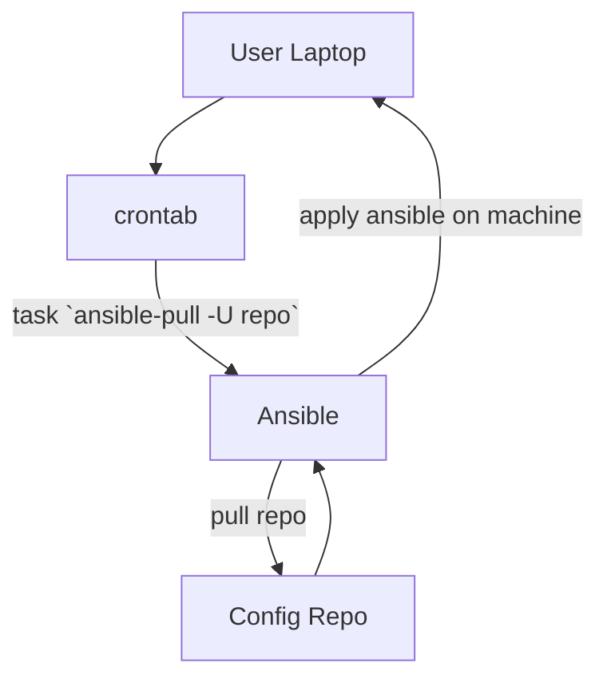

# Автоматизация настройки окружения macOS с помощью Ansible-Pull

## Проблематика

Последние 3 года я использую macos, на двух работах у меня уже 5 замена ноутбуков и каждый раз переезд дается не просто, потому что второго личного ноута у меня нет :)

Подход со снэпшотами (Time Machine) мне не очень нравится, мне кажется что удачная идея относится к своей рабочей машине как и к серверам - стараться сделать из нее "stateless" историю, а все настройки производить через **IaC**

## Решение

В итоге получилась очень простая схема:

1. На локальной машине через cron запускается `ansible-pull -U https://github.com/kb play.yml`
2. **ansible** клонирует репозиторий, и выполняет плейбук по указанному пути (в моем случае плейбук раскатывается по localhost)

## Вывод
- описание своего рабочего окружения в **IaC** (софт,gui приложения,конфиги) кажется отличной идеей "на будущее"
- крайне удобно работать с **IaC** по **GitOps** подходу - когда конфигурации сами применяются и поддерживают желаемое состояние (*в ansible конечно не настоящий GitOps, скорее автоматизация*)

## Cсылки
- [github ansible role macos-env](https://github.com/karma-git/kb/tree/master/ansible/roles/macos-env)
- [ansible-pull docs](https://docs.ansible.com/ansible/latest/cli/ansible-pull.html)
- [ansible gitops](https://www.ansible.com/blog/ops-by-pull-request-an-ansible-gitops-story)
- [ansible-pull & cron quickstart](https://www.devopsschool.com/blog/what-is-ansible-pull-and-how-can-we-use-it/)

