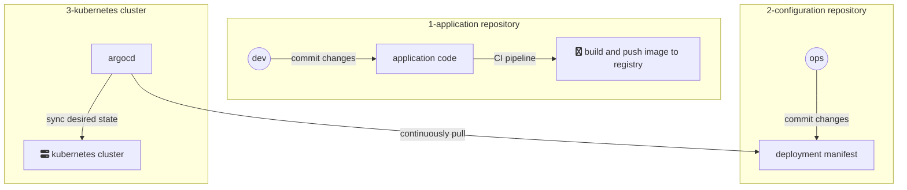
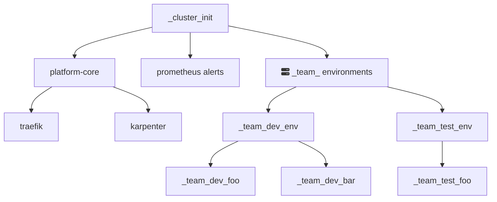

Argo CD - это **GitOps контроллер**, который **применяет** конфигурации (plain-yaml манифесты, helm чарты) из **git репозитория** в kubernetes кластере и поддерживает это **желаемое состояние**.

## Полезные ссылки

!!! note

    - :construction: ArgoCD Core Concepts https://argo-cd.readthedocs.io/en/stable/core_concepts/
    - Официальная документация https://argo-cd.readthedocs.io/en/stable/
    - Обзорное видео от TechWorld with Nana
    https://youtu.be/MeU5_k9ssrs

## Типовая схема развертывания новых версий приложения



1. `application repository` - Разработчик изменяет код приложения, в результате чего CI пайплайн собирает новую версию docker образа и доставляет ее в container registry.

2. `configuration repositor` - Отвественный инженер изменяет версию образа в манифест-е `Deployment`-а.

3. `kubernetes cluster` - Argo CD забирает изменения из репозитория(**refresh**), видит что состояния кластера (**live state**) не соответствует конфигурациям из репозитория (**target | desired state**) и применяет их (**sync**).

!!! note

    Разделения репозиториев с манифестами арго от кода приложения является лучшей практикой по мнению многих инженеров, а так же сам argo говорит об этом https://argo-cd.readthedocs.io/en/stable/user-guide/best_practices/

## Application - CRD объект

В общем понимании **Application** - это сути указатель на конфигурации которые argo будет применять в кластер.

В Core Concepts описаны следующие понятия, которые важны при работе с этим CRD:

1. **Tool** - это способ получения конфигураций, это может быть plain-yaml манифесты или утилиты теймплейтирования такие как helm, kustomize, jssonnet

2. **Source** - на самом деле такого понятия нет, но важно понимать, что Application может брать конфигурации как из git репозитория, так и из OCI репозиторием (это название для хранилищ helm chart-ов)

Ниже приведены примеры обоих кейсов.

=== "tool - directories, source - git repo"

    ```yaml
    ---

    kind: Application
    apiVersion: argoproj.io/v1alpha1
    metadata:
      name: project-app
      namespace: argocd
    spec:
      project: default
      source:
        repoURL: https://gitlab.com/infra/sandbox.git # (1)
        targetRevision: master # (2)
        path: sandbox/project-app # (3)
        directory: # (4)
          recurse: true
      destination:
        namespace: sandbox
        server: https://kubernetes.default.svc
      syncPolicy:
        automated:
          selfHeal: true
          prune: true
    ```

    1.  ссылка на `git` репозиторий
    2.  ветка или другой reference
    3.  путь до манифестов внутри репы
    4.  tool - директории

=== "tool - helm, source - OCI repo"

    ```yaml
    ---

    kind: Application
    apiVersion: argoproj.io/v1alpha1
    metadata:
      name: word-press
      namespace: argocd
    spec:
      project: sandbox
      source:
        repoURL: https://charts.bitnami.com/bitnami # (1)
        chart: wordpress # (2)
        targetRevision: "15.2.2" # (3)
        helm:
          values: | # (4)
            wordpressUsername: admin
            wordpressPassword: qwerty

            wordpressFirstName: Infra
            wordpressLastName: Engineer
            wordpressBlogName: Platform Blog

            service:
              type: ClusterIP

            mariadb:
              enabled: true
              architecture: standalone
              auth:
                rootPassword: "mariadb"
                database: bitnami_wordpress
                username: bn_wordpress
                password: "mariadb"
              primary:
                persistence:
                  enabled: true
                  storageClass: ebs-gp3-ext4-eu-west-1b
                  accessModes:
                    - ReadWriteOnce
                  size: 5Gi

            memcached:
              enabled: true
              auth:
                enabled: true
                username: "admin"
                password: "qwerty"

      destination:
        namespace: env-ahorbach
        server: https://kubernetes.default.svc
      syncPolicy:
        automated:
          selfHeal: true
          prune: true
    ```

    1.  ссылка на `helm` репозиторий, как правило фигурирует в readme к чарту`helm repo add bitnami https://charts.bitnami.com/bitnami`
    2.  имя чарта можно увидеть в файле Chart.yaml
    3.  версию чарта можно увидеть в файле Chart.yaml
    4.  helm параметры передающиеся в чарт, можно выносить в отдельный файл для упрощения yaml синтаксиса

### Project, syncPolicy

Некоторые параметры были обделены вниманием намеренно, потому что мы рекомендуем оставлять их в таком состоянии как в примерах выше.

Но при желании вы можете ознакомиться с ними самостоятельно с помощью документации или спеки CRD, например: `kubectl explain application.spec.syncPolicy.automated`

```yaml
---

kind: Application
apiVersion: argoproj.io/v1alpha1
metadata:
  name: project-app
  namespace: argocd
spec:
  project: default # (1)
  source:
    repoURL: https://gitlab.com/infra/sandbox.git
    targetRevision: master
    path: sandbox/project-app
    directory:
      recurse: true
  destination:
    namespace: sandbox
    server: https://kubernetes.default.svc
  syncPolicy:
    automated: # (2)
      selfHeal: true # (3)
      prune: true # (4)
      allowEmpty: false # (5)
```

1. project позволяет группировать Application-ы и раздавать на них права, у арго есть свой RBAC, но **мы это не используем**
2. **Sync** будет выполняться **автоматически** после **Refresh**
3. Если мы изменим ресурс, который контролирует арго - оно вернет все назад (**target state**)
4. Если мы удалим в гите ресурс за Application, арго тоже его **удалит**
5. **Защита** от человеческого фактора, не позволит удалить ресурсы за Application-ом если арго смотрит в пустую директорию

### GC

Если вы удалите приложение в Git, то можете столкнуться с ситуацией в которой объекты за этим приложением остались в кластере. Это еще один механизм защиты от человеческой ошибки.

Для того, чтобы удалить все за приложением, следует добавить такую аннотацию и запушить изменения в git.

```yaml hl_lines="8 9"
---

kind: Application
apiVersion: argoproj.io/v1alpha1
metadata:
  name: project-app
  namespace: argocd
  finalizers:
    - resources-finalizer.argocd.argoproj.io
spec:
...
```

И только после того как argo обновит этот Application с финалайзером - манифест Application-а можно удалять.

### Orphan resources

!!! note

    https://argo-cd.readthedocs.io/en/stable/user-guide/orphaned-resources/

На `project` можно повесить отслеживание за ресурсами, которыми Argo не управляет. Т.к. `Application` как правило деплоит ресурсы в один namespace, то в UI этого application-а будет висеть **WARNING**, если какие либо ресурсы в этом ns-е не созданы argo

## UI

!!! note

    Скриншоты можно найти в документации, например в этой статье https://argo-cd.readthedocs.io/en/stable/getting_started/#7-sync-deploy-the-application

У Арго потрясающее UI - оно может одновременно являться и средством визуализации, траблшутинга и observability, а так же управления workloads.

Из наиболее важного, это мониторинг объектов:

:green_heart: - это **Health**, как правило этим атрибутом обладают объекты типа **Pod** и вышестоящие над ними абстракции. Если Health не зеленый - то очевидно что-то не так (по каким-то причинам не может скачать образ, контейнер падает с ошибкой exit 1 и т.д.)

:white_check_mark: - **Sync** - эта концепция означает соответствие
объекта с **target state**. Если Sync не зеленый - по каким-то причинам Argo не смог достичь target state, это часто является следствием ошибок в конфигурациях.

В случае ошибок - можно кликнуть на объект, посмотреть его Event (то что можно увидеть внизу вывода `kubectl describe object`), для pod-ов также можно глянуть log-и. А так же в зависимости от объекта можно делать rollout restart, trigger job, в конце-концов удалять объекты.

## Apps of Apps

!!! Quote

    https://argo-cd.readthedocs.io/en/stable/operator-manual/declarative-setup/#app-of-apps

    You can create an app that creates other apps, which in turn can create other apps. This allows you to declaratively manage a group of apps that can be deployed and configured in concert.

Один из возможных подходов, в котором вершиной графа является один `Application`, который смотрит на директорию `_cluster_init` в которой уже лежат другие `Application`-ы

Граф зависимостей при этом выглядит примерно так:



## Q&A

`Я удалил манифест арго, а ресурсы остались в kubernetes`

:   Прочтите секцию GC данного гайда

`Я запушил манифесты в git, но ничего не происходит`

:   По дефолту арго опрашивает репозитории раз в 3 минуты, Refresh можно сделать вручную нажав соответствующую кнопку. Так же вы можете для вашего репозитория сделать webhook - в таком случае арго будет реагировать моментально

`Почему нет ApplicationSet?`

:   Собираюсь разобраться, но пока сроков нет :octopus:
