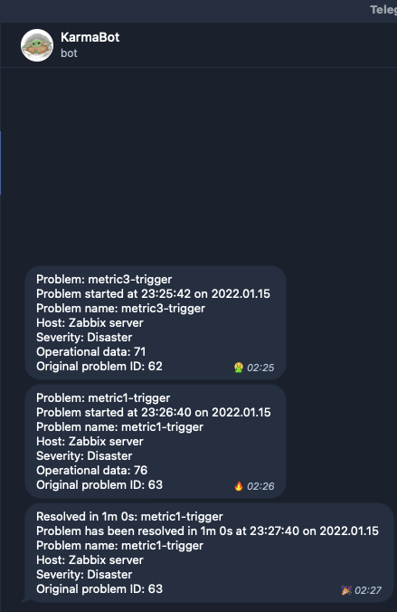

# Задание
**Название**: Настройка zabbix, создание LLD, оповещение на основе
триггеров\
\
**Цель и результат ДЗ**: Установить и настроить zabbix, настроить
автоматическую отправку аллертов в телеграмм канал\
\
**Пошаговая инструкция:**\
Домашнее задание представляет из себя следующее.

Необходимо сформировать скрипт генерирующий метрики формата:

important_metrics\[metric1\]

important_metrics\[metric2\]

important_metrics\[metric3\]

С рандомным значение от 0 до 100

Создать правила LLD для обнаружения этих метрик и автоматического
добавления триггеров. Триггер должен срабатывать тогда когда значение
больше или равно 95.

Реализовать автоматическую отправку уведомлений в телеграмм канал.

В качестве результаты выполнения дз Вы должны предоставить скрипт
генерации метрик, скриншоты графиков полученных метрик, ссылку на
телеграмм канал с уже отправленными уведомлениями.

**Критерий оценивания:**\
0 баллов: задание не выполнено

1 балл: задание выполнено полностью

# Выполнение

<details>
<summary>Links</summary>

### User parameters
- https://sbcode.net/zabbix/user-parameters/
- https://sbcode.net/zabbix/media-types-telegram-webhook/
- https://sbcode.net/zabbix/trigger-macros/

### TG
- https://blog.mailon.com.ua/%D1%83%D0%B2%D0%B5%D0%B4%D0%BE%D0%BC%D0%BB%D0%B5%D0%BD%D0%B8%D1%8F-%D0%BE%D1%82-zabbix-%D0%B2-telegram/
- https://git.zabbix.com/projects/ZBX/repos/zabbix/browse/templates/media/telegram

### LLD
- https://www.zabbix.com/documentation/current/ru/manual/discovery/low_level_discovery

</details>

## Zab install

```shell
make install-zabbix
```
## Zabbix configure

```shell
poetry install
make py-zabbix
```

## future manually steps
> I faced an issue with user.update (mediatype) view, so this step should be done manually
>
> Go to Administration -> Users -> 'Admin' -> Media -> add `Telegram` and put into sendto field your `Telegram ID`.
>
> Then go to Configration -> Actions -> Trigger Actions and enable check mark for `Report problems to Zabbix administrators`.

# Result
You should recive an alert soon:
<details>
<summary>Alert</summary>


</details>