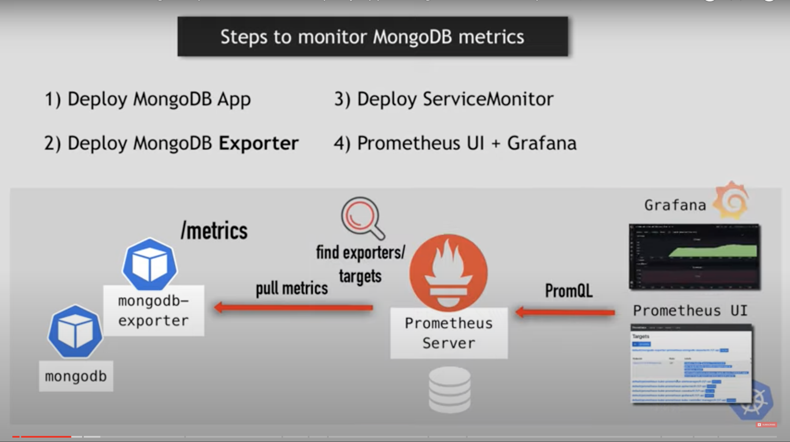
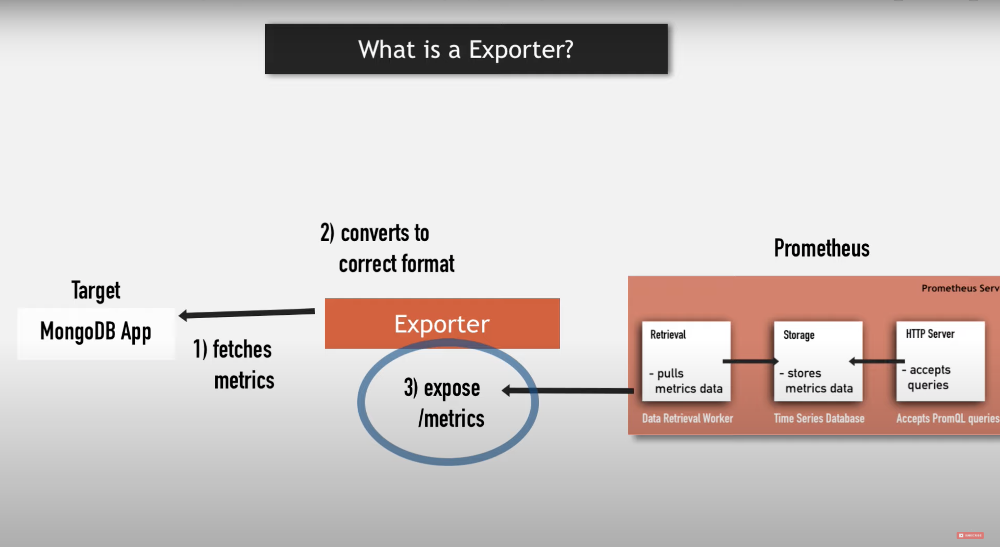

# Overview

Links:
- [Prometheus Monitoring](https://www.youtube.com/watch?v=mLPg49b33sA) by TechWorld with Nana.
- [GAP stack chart](https://github.com/prometheus-community/helm-charts/tree/main/charts/kube-prometheus-stack)
- [MongoDB exporter chart](https://github.com/prometheus-community/helm-charts/tree/main/charts/prometheus-mongodb-exporter)

Up all resourses
```shell
make all
```

Endpoints:
- [http://127.0.0.1:9216/metrics](MongoDB exporter)
- [http://127.0.0.1:3000/](Grafana)
- [http://127.0.0.1:9093/](AlertManager)
- [http://127.0.0.1:9090/](Prometheus)

<details>


---

---


</details>