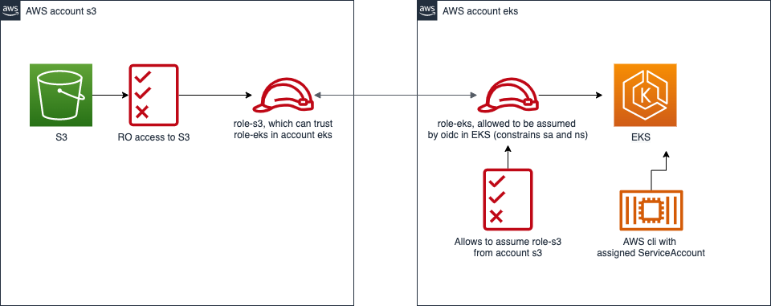

# Overview

Inspired by [Enabling cross-account access to Amazon EKS cluster resources](https://aws.amazon.com/ru/blogs/containers/enabling-cross-account-access-to-amazon-eks-cluster-resources/).

Scenario: Need to access S3 bucket (account **s3**) from Pod (account eks).



Let's provision resources via terraform:

> !NOTE: expected that eks cluster has been already created.
```shell
terraform init
terraform plan
terraform apply
```
Replace placeholders (`__S3_ROLE_ARN__` & `__EKS_ROLE_ARN__`) in the k8s manifest with proper roles ARNs and create ConfigMap, ServiceAccount and Deployment.
```shell
kubectl create -f kubernetes.yml
```

Exec into pod and make a request to desired S3 bucket:
```shell
kubectl -n default exec -it demo-s3-eks-deploy-<tab> -- sh
aws s3 ls s3://<s3_name>
```
