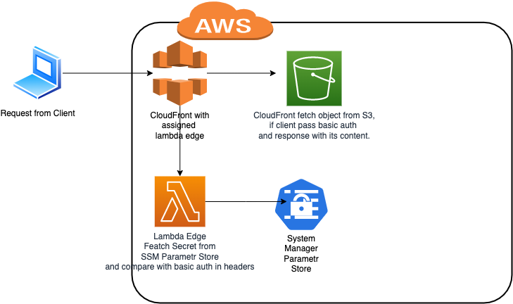

# Overview

Scenario: Need to access objects inside S3 bucket from public network and secure them, for example with basic auth.



Let's provision resources via terraform:

> !NOTE: expected that eks cluster has been already created.
```shell
terraform init
terraform plan
terraform apply
```

Upload current readme to s3:
```shell
❯ aws s3 cp README.md s3://s3-demo     
upload: ./README.md to s3://s3-demo/README.md
```
Featch secret value from ssm:
```shell
❯ aws ssm get-parameters --name s3-demo-password --region eu-west-1 --with-decryption --output json | jq '.Parameters[].Value'
"AIjzUKrZenmqqOXB"
```
Fetch object from bucket via http reuqest:
```shell
❯ http -a s3-demo-user:AIjzUKrZenmqqOXB https://dfz82sg3a55og.cloudfront.net/README.md 
HTTP/1.1 200 OK
Accept-Ranges: bytes
Connection: keep-alive
Content-Length: 414
Content-Type: binary/octet-stream
Date: Sun, 19 Dec 2021 16:02:33 GMT
ETag: "959d579cf449dbfcc72295c01b5f92e3"
Last-Modified: Sun, 19 Dec 2021 15:59:03 GMT
Server: AmazonS3
Via: 1.1 c68aa4270b22c7e4e7044fd6df451f71.cloudfront.net (CloudFront)
X-Amz-Cf-Id: CHn7BfMv4PgBEoXFf6OYoMesaffBnYpV9AjBay_JlzDXZVyg8CJmZg==
X-Amz-Cf-Pop: HEL50-C1
X-Cache: Miss from cloudfront
x-amz-id-2: pny92C0radV0T1Ka3TmPhiNs8DC5+DzTkENbLXPTb7RicpNesH2FuS55+V6rlI7n/x89JXnHcqc=
x-amz-request-id: MQTXBJSD69C3Y39V

# Overview

Scenario: Need to access objects inside S3 bucket from public network and secure them, for example with basic auth.
...
```
